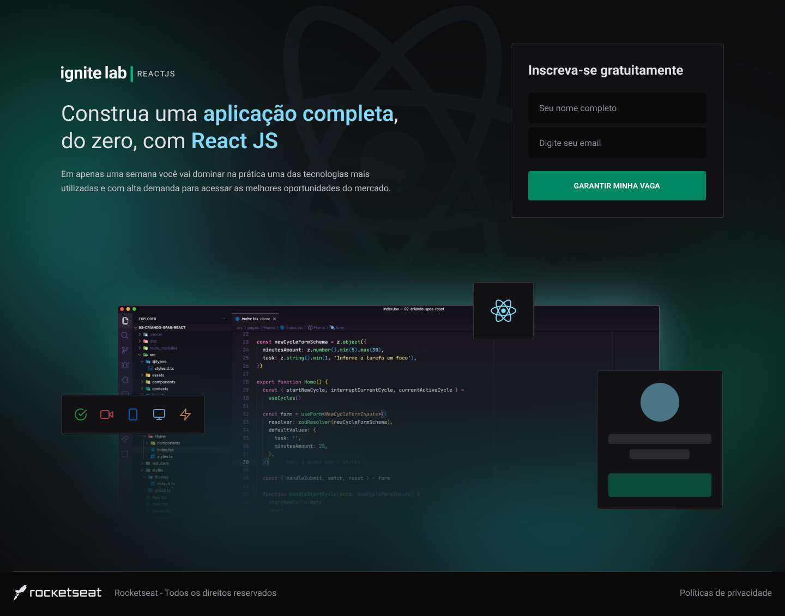
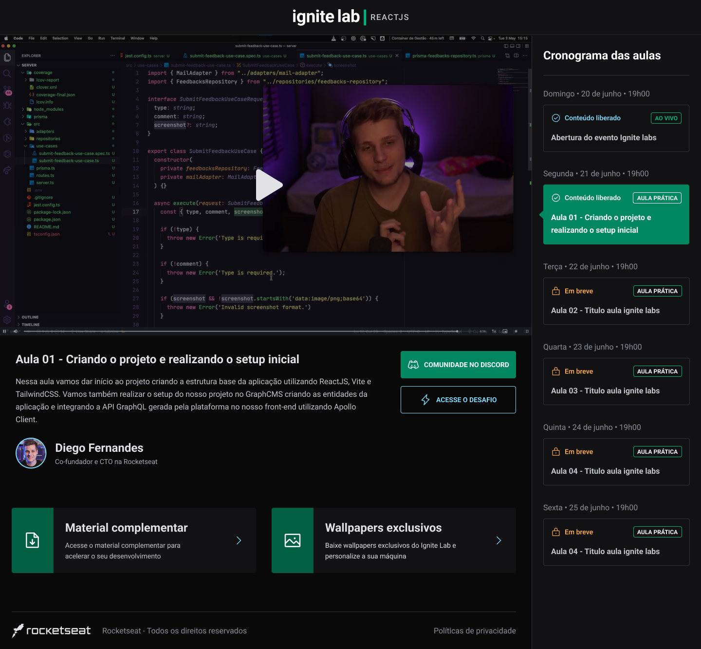

  

  Project developed at Ignite LAB - React 🚀

  Go check it out: <a href="https://ignite-lab-event-platform-q6wrxk070-k4me.vercel.app/"> Event Platform </a>

## 👀 Images

  
  

## 🔖 Layout

You can view the project layout through the link below:

- [Event Plantform - Figma](https://www.figma.com/community/file/1120711251998877938)

Remembering that you need to have a [Figma](http://figma.com/) account to access it.

## 🚀 Technologies

- [ReactJS](https://reactjs.org/)
- [TypeScript](https://www.typescriptlang.org/)
- [Tailwind CSS](https://tailwindcss.com/)
- [Phosphor](https://phosphoricons.com/)
- [Vitejs](https://vitejs.dev/)
- [graphql](https://graphql.org/)
- [graphcms](https://graphcms.com/)
- [codegen](https://www.graphql-code-generator.com/)

## 💻 Getting started

First, clone de project:

    git clone https://github.com/K4ME/Ignite-Lab-event-platform.git

Install the dependencies

    npm install

Run the code

    npm run dev

  Made with 💜 by <a href="https://www.linkedin.com/in/guilhermemacrini/">Guilherme Macrini</a>

